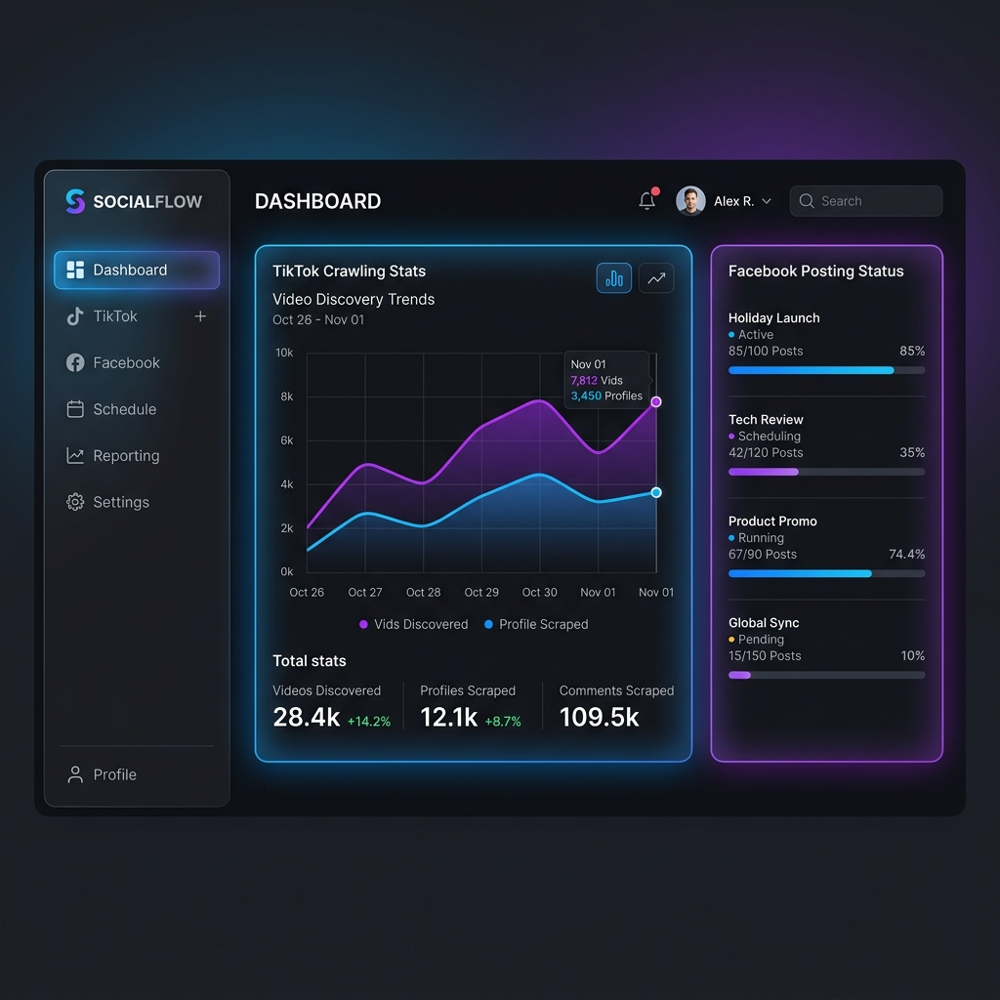
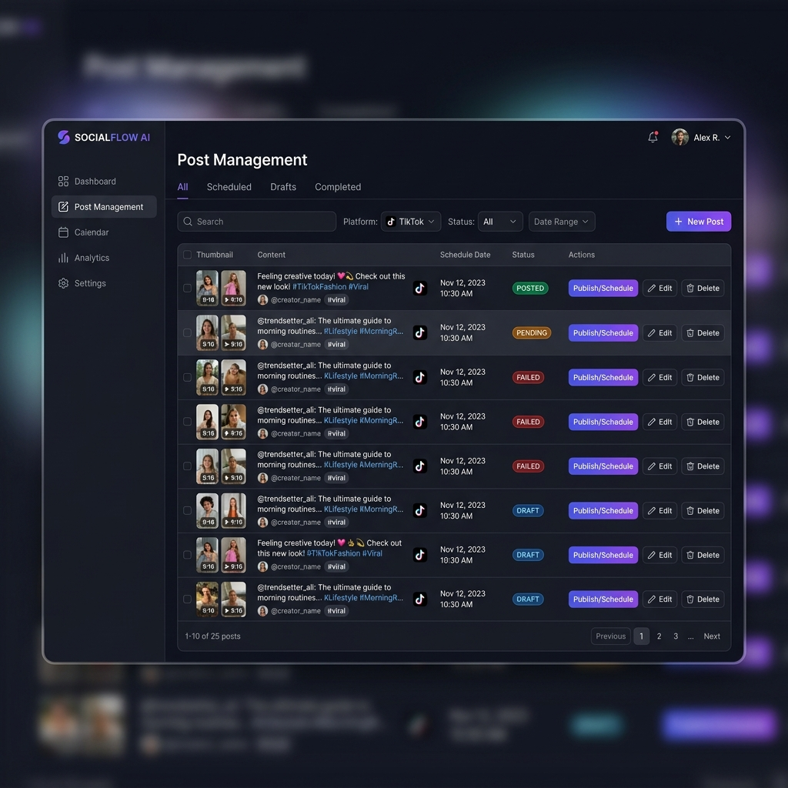

# TikTok-to-Facebook Auto Content Pipeline

An automated system to crawl TikTok posts, generate AI-enhanced captions, and auto-post them to Facebook Pages. Includes a real-time monitoring dashboard and automated comment interaction.

## 🚀 Overview

This project provides an end-to-end pipeline for social media content automation:
1.  **Crawl:** Automatically discover and download trending TikTok videos using `yt-dlp`.
2.  **Generate:** Use Google Gemini AI to create engaging, context-aware captions for each video.
3.  **Post:** Automatically publish content to Facebook Pages via the Graph API.
4.  **Engage:** Automate comment replies using AI-integrated backends (optional/configured).
5.  **Monitor:** Track performance and pipeline status through a modern React dashboard.

## 📸 Screenshots

| Dashboard Overview | Post Management |
| :---: | :---: |
|  |  |

*(Place your actual screenshots in a `docs/` folder and update these paths)*

## 🛠 Tech Stack

*   **Backend:** FastAPI (Python 3.10+)
*   **Frontend:** React + Vite + Tailwind CSS
*   **Database:** PostgreSQL 15
*   **AI:** Google Gemini API
*   **Tunneling:** Cloudflare Tunnel (for webhook access)
*   **Orchestration:** Docker Compose

## ⚙️ Setup & Installation

### Prerequisites

*   Docker and Docker Compose installed.
*   Google Gemini API Key (for AI captions).
*   Facebook Developer App (for Graph API access).
*   Cloudflare Tunnel Token (if using webhooks).

### Configuration

1.  **Clone the repository:**
    ```bash
    git clone https://github.com/duytk9/auto-crawl-tiktok-post-fb.git
    cd auto-crawl-tiktok-post-fb
    ```

2.  **Configure Environment Variables:**
    Edit the `docker-compose.yml` file or create a `.env` file (if configured) with the following:
    ```yaml
    GEMINI_API_KEY=your_gemini_key
    ADMIN_PASSWORD=your_dashboard_password
    BASE_URL=your_tunnel_domain
    TUNNEL_TOKEN=your_cloudflare_tunnel_token
    ```

3.  **Launch the System:**
    ```bash
    docker-compose up -d --build
    ```

### Accessing the Dashboard

*   **Frontend:** `http://localhost:5173`
*   **Backend API:** `http://localhost:8000/docs`
*   **Database:** Port `5432`

## 📂 Project Structure

```text
.
├── backend/            # FastAPI Application
│   ├── app/            # Core logic (API, Services, Models, Worker)
│   └── Dockerfile
├── frontend/           # React + Vite Dashboard
│   ├── src/            # Components, Hooks, API logic
│   └── Dockerfile
├── database/           # Postgres data persistence
├── videos_storage/     # Temporary storage for crawled videos
└── docker-compose.yml  # System orchestration
```

## 📝 Features

- [x] **TikTok Crawling:** Robust video downloading with metadata extraction.
- [x] **AI Captions:** Dynamic caption generation using GEMINI.
- [x] **Facebook Posting:** Direct-to-Fanpage publishing.
- [x] **Cloudflare Tunnel:** Easy webhook setup without port forwarding.
- [x] **Responsive Dashboard:** Real-time visibility into the content queue.

## 🤝 Contributing

Feel free to open issues or submit pull requests for any improvements.

---
*Developed for automated social media management workflows.*
